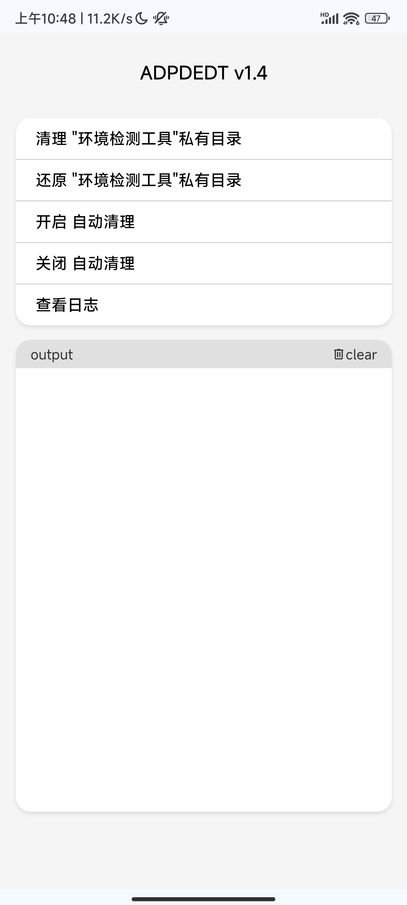

# ADPDEDT

自动删除环境检测工具私有目录（Automatically Delete Private Directories of Environment Detection Tools）

------

## 1. 模块介绍&诞生背景

正如字面意思，该模块的作用是 自动删除环境检测工具私有目录。

原因也很简单，现在越来越多软件的环境检测开始扫描 `/sdcard/Android` 等目录，并寻找常见的环境检测工具（如 Native Test）。该检查结果会直接影响最终的环境判定结果。

## 2. 如何触发删除

目前触发方式主要为以下三种：

1. 每次开机后自动激活
2. 在root管理器的模块管理中，手动激活
3. 在终端，手动执行脚本文件 `/data/adb/modules/ADPDEDT/action.sh` （需要root权限）

## 3. 删除名单

（排名不分先后）

    1. Momo (io.github.vvb2060.mahoshojo)
    2. Ruru (com.byxiaorun.detector)
    3. Hunter (com.zhenxi.hunter)
    4. Native Test ++ (原版) (icu.nullptr.nativetest)
    5. Native Test (共存版) (com.android.nativetest)
    6. MemoryDetector (io.github.huskydg.memorydetector)
    7. Applist Detector (icu.nullptr.applistdetector)
    8. Luna (luna.safe.luna)
    9. 应用列表检测器 (com.tsng.applistdetector)
    10. 密钥认证 (io.github.vvb2060.keyattestation)
    11. Oprek Detector检测软件 (com.godevelopers.OprekCek)
    12. Play Integrity API Checker (gr.nikolasspyr.integritycheck)
    13. prop detector (com.fantasytat.propdetector)
    14. Yet Another SafetyNet Attestation Checker(YASNAC) (rikka.safetynetchecker)
    15. Native Detector (com.reveny.nativecheck)
    16. Holmes (me.garfieldhan.holmes)
    17. APT检测 (com.youhu.laifu)
    18. 春秋检测 (com.chunqiu.detector)
    19. LingQingDetector (com.lingqing.detector)

## 4. 暂不考虑删除名单

有部分工具（如 Shizuku、Scene等）即使没有root权限，也仍然是非常好用的工具。因此个人认为，将其列入删除列表不妥

目前不考虑删除的名单如下（排名不分先后）：

    1. Shizuku
    2. Scene
    3. MT管理器
    4. 爱玩机工具箱

## 5. 日志

脚本的运行日志保存在 `/data/adb/ADPDEDT/log/ADPDEDT.log`，脚本每次运行时会清除上一次的日志。

## 6. 致谢
本项目借鉴了诸多模块的源代码，以下为具体项目致谢（排名不分先后）：

    模块基本结构：MMT-Extended (https://github.com/Zackptg5/MMT-Extended)
    安装脚本中判断模块刷入环境：LSPosed (https://github.com/LSPosed/LSPosed)
    安装脚本中输出格式与刷入逻辑：zerotier-magisk (https://github.com/eventlOwOp/zerotier-magisk)
    Ksu WebUI 界面：Play Integrity Fix(https://github.com/chiteroman/PlayIntegrityFix)
    `action.sh`跳转Ksu WebUI：Tricky-Addon-Update-Target-List (https://github.com/KOWX712/Tricky-Addon-Update-Target-List)
 